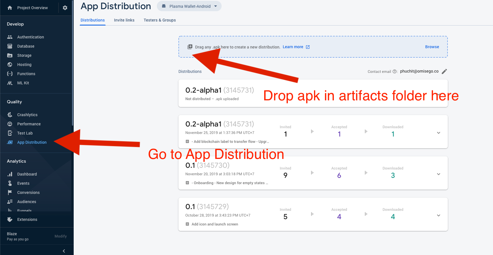

# Release Android APK To Firebase App Distribution

1. Make change to the `versionName` at `android/app/build.bundle`.
2. Generate the release apk by running `npm run build-android`. The generated apk file can be found at the `artifacts` folder.
3. Go to firebase console. Then follows instructions below:

