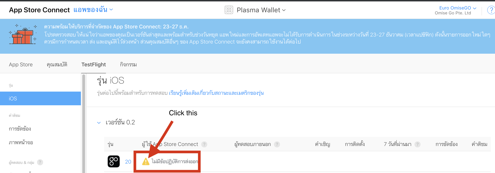
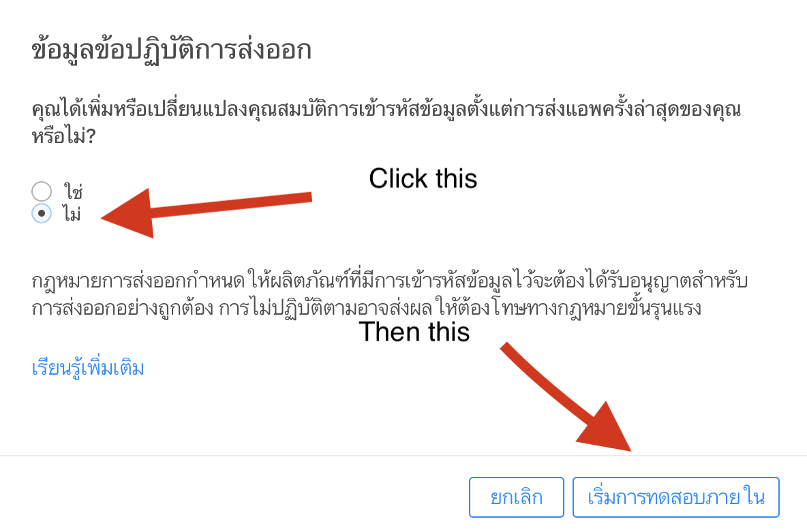
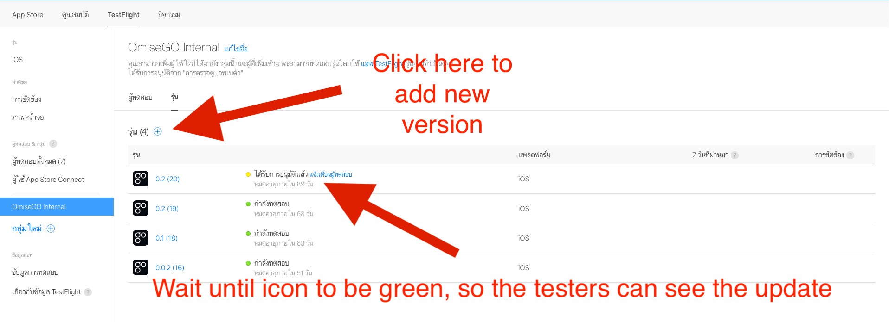
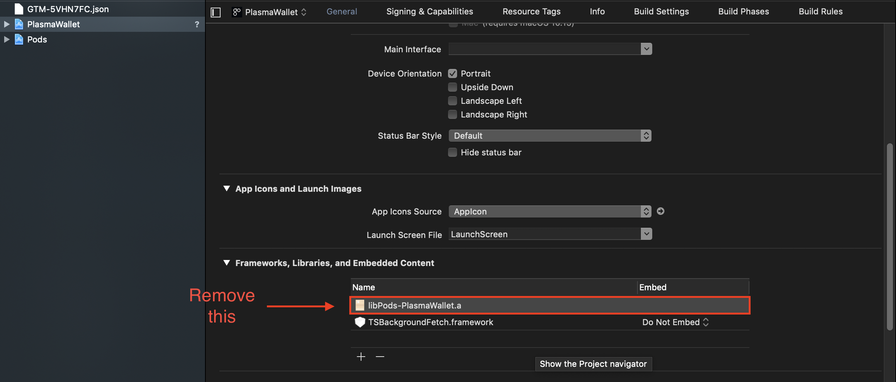

# Release iOS IPA to the Testflight

## Installation

1. Make sure you have the latest version of the Xcode command line tools installed:

```sh
xcode-select --install
```

2. Install _fastlane_ using `brew cask install fastlane` or alternatively `[sudo] gem install fastlane -NV`.

3. Create a `.env.default` file in the `ios` folder and add your configuration:

```env
FASTLANE_USER     Your App Store Connect Email
MATCH_GIT_URL     The URL of the GitHub repo containing certificates and provisioning profiles for match signing
```

4. From the `/ios` directory, run `pod install`.

5. Also from the `/ios` directory, run `fastlane ios testflight_local` and wait for the job to complete.

6. Go to https://appstoreconnect.apple.com/WebObjects/iTunesConnect.woa/ra/ng/app/1482235242 (You need to login first)

7. Go to `Testflight`, then please follow steps below:







**Note**: If you found error about `library not found for -lPods-PlasmaWallet` when archiving, the temporary solution was to:

1. Go to General
2. Scroll down to `Frameworks, Libraries, and Embedded Content`
3. Remove `libPods-PlasmaWallet.a`.
4. Archive again.

For reference:


