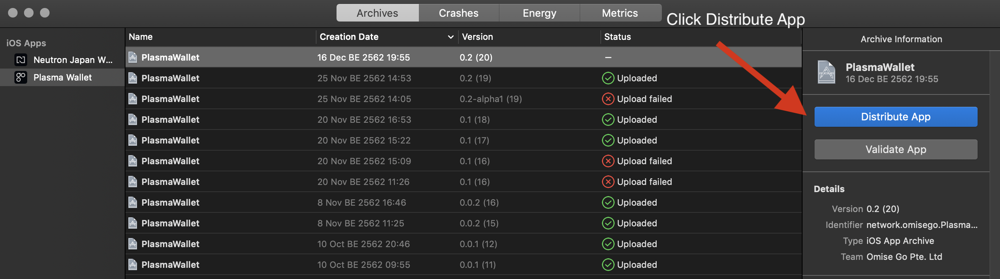
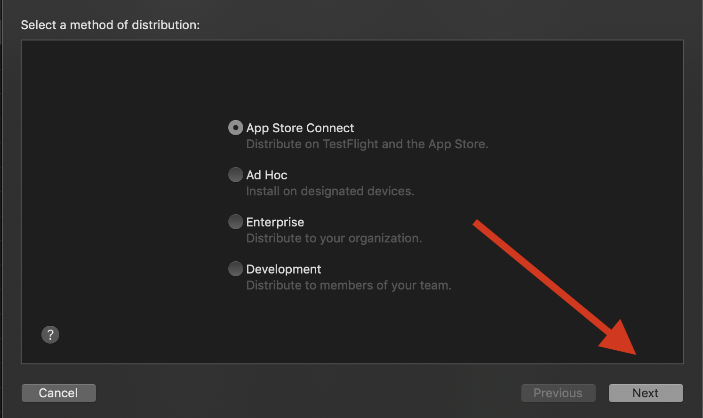

# Release iOS IPA to the Testflight

1. Open Xcode at `ios`
2. If you don't have apple ids belong to OmiseGO team, get that first, then go to `Preference > Accounts` and add it.
3. In `Signing & Capabilities` make sure that the team is `Omise Go Pte. Ltd`
4. In `General` bump the build version so it won't conflict with the previous builds.
5. Go to `Product > Archive` waiting the build to finish, then follow the instructions below:

6. Go to https://appstoreconnect.apple.com/WebObjects/iTunesConnect.woa/ra/ng/app/1482235242 (You need to login first)

7. Go to `Testflight`, then please follow steps below:

**Note**: If you found error about `library not found for -lPods-PlasmaWallet` when archiving, the temporary solution was to:

1. Go to General
2. Scroll down to `Frameworks, Libraries, and Embedded Content`
3. Remove `libPods-PlasmaWallet.a`.
4. Archive again.

For reference:

